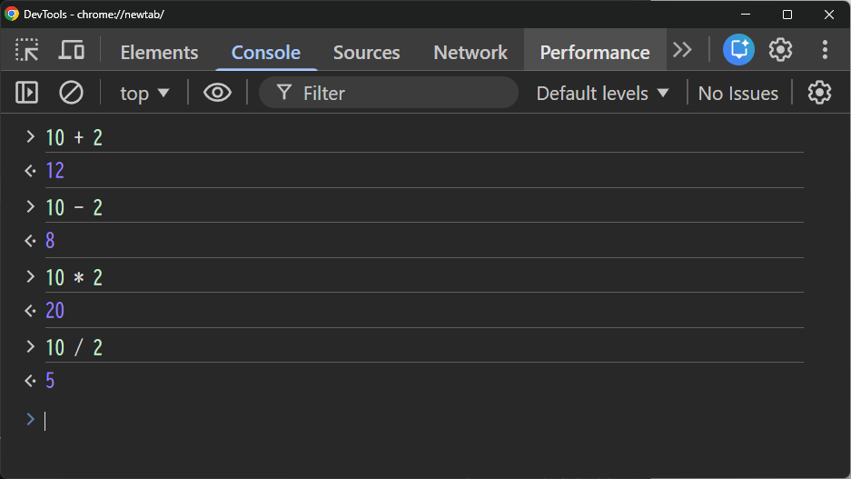

# 形式張らないJavaScriptの紹介

この章ではJavaScriptコンソールを利用します。
JavaScriptコンソールでは1行ずつ入力したコードを、1行ずつ実行できます。
プログラミング経験のない方であっても簡単にJavaScriptを試してみることができます。

## JavaScriptを電卓として使う

それでは、簡単なJavaScriptの例をいくつか試しましょう。
プロンプト(`>`のマーク)の後に続けてJavaScriptの入力を行うことが出来ます。

数値のみを扱う場合において、JavaScriptコンソールは単純な電卓のように動作します。
式を入力すると、その結果が表示されます。式の文法は難しくありません。
演算子`+`, `-`, `*`, `/` は他のほとんどの言語と同じように動作します。
丸括弧をグループ化に使うこともできます。いくつか試してみましょう。

### 足し算

`+`演算子（プラス）を使うことで数値と数値を足すことができます。

```js
10 + 2
```

### 引き算

`-`演算子（ハイフン）なら引き算
```js
10 - 2
```

### 掛け算

`*`演算子（アスタリスク）なら掛け算

```js
10 * 2
```

### 割り算

`/`演算子（スラッシュ）は割り算です

```js
10 / 2
```

実行例



### 少し複雑な計算

`.`（ドット/ピリオド）を使って小数を表現したり、
数値の直前に`-`を付けて`0`よりも小さい数を表現できます。

```js
1.0 + 0.5
```

```js
10 + (-2)
```

`()`で括ることで計算の順番を指定することもできます。
下記の２つの計算式をそれぞれ実行してみて、結果が異なることを確認してください。

```js
1 + 2 * 3 + 4
```

```js
(1 + 2) * (3 + 4)
```

## 文字列

次に文字列です。
シングルクォート（`'あいうえお'`）またはダブルクォート(`"かきくけこ"`)で括った範囲が文字列となります。

`+`演算子は数値の足し算にも使用しましたが、文字列に対して使用すると文字列を連結することができます。

```js
'おーい' + "お茶"
```


## 数値と文字列を区別する

プログラムの世界で数値と文字列は明確に区別されます。
例えば
```js
10
```
と
```js
'10'
```
の見た目はよく似ていますが、`10`は数値で`'10'`は文字列です。
```js
10 + 10
```
と
```js
'10' + '10'
```
の結果を予想してから実行してみましょう。

## 変数と定数

変数をや定数を使うとデータに名前をつけることができます。

### 変数(`let`)

変数を利用するには最初に`let`キーワードを使って、変数を宣言します。


変数に値を代入すると、変数の名前を使って値にアクセスすることができます。

```js
let hp = 30
let atack = 10
```
今の値を確認して
```js
hp
```
変数の値を変更してみましょう
```js
hp = hp - atack
```
値がどの様に変わったか確認してください
```js
hp
```

### 定数(`const`)

定数は値を変更できない変数です。
「変更されるべきではない値」や「変更の必要がない値」を定数として宣言することで
値が変更されないことを保証したり、意図しない変更を防ぐことができます。


```js
const name = 'ロト'
```

ちゃんと代入できたか確認して

```js
name
```

代入した定数を使ってみましょう

```js
'おお　' + name + 'よ　しんでしまうとは　なさけない'
```

最後に定数の値を変更して、結果を確認してみましょう。

```js
name = 'アルス'
```

## まとめ

- JavaScriptでは数値や文字列を扱うことができる
    - 数値は四則演算などの計算ができる
    - 文字列は文字列同士の連結などができる
- 変数と定数には値を代入することができる
    - 変数は`let`で宣言する
    - 変数の値は変更できる
    - 定数の`const`で宣言する
    - 定数の値は変更できない
