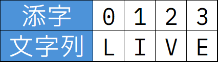

# string(文字列値)

文字列型の正式な名前は`string`型です。
string型も文字列同士の連結だけでなく、色々が操作が可能なので、その一部を紹介します。

## 大文字へ変換

[`.toUpperCase()`](https://developer.mozilla.org/ja/docs/Web/JavaScript/Reference/Global_Objects/String/toUpperCase)メソッドを使って、半角アルファベットを小文字から大文字へ変換できます。

```js
const lowerName = 'taro';
const upperName = lowerName.toUpperCase();
console.log(upperName); // 'TARO'
```

## 小文字へ変換

[.toLowerCase()](https://developer.mozilla.org/ja/docs/Web/JavaScript/Reference/Global_Objects/String/toLowerCase)メソッドは逆に小文字への変換です。

```js
const lowerName = 'JIRO'.toLowerCase();
console.log(lowerName); // 'jiro'
```

## n文字目の文字を取得

文字列の直後に`[n]`（添字）を付けることで、文字列のn文字目の文字を取得することができます。
プログラムの世界では数字は`0`から数え始めるので、最初の1文字目を取得するには`[0]`、2文字目を取得するには`[1]`を指定します。



```js
const word = 'LIVE';

console.log(word[0] + word[1] + word[2] + word[3]); // 'LIVE'
console.log(word[3] + word[2] + word[1] + word[0]); // 'EVIL'
```

## もっと詳しく知りたい場合

- [String - MDN](https://developer.mozilla.org/ja/docs/Web/JavaScript/Reference/Global_Objects/String)
