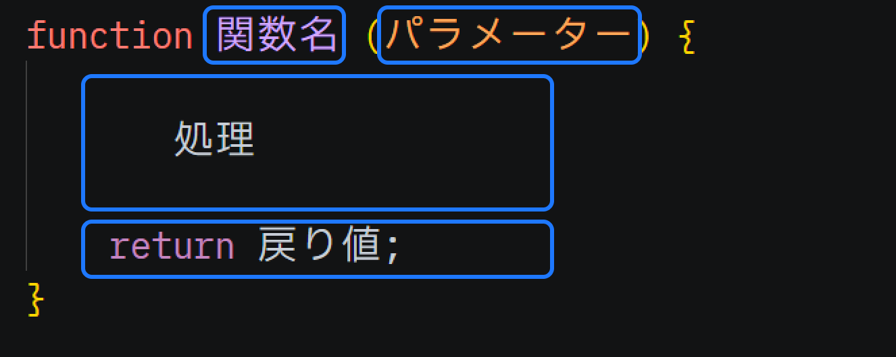

# 関数にパラメータを追加する

関数に渡すことが出来るパラメータのことを「引数（ひきすう）」と呼びます。
これまでにも`console.log(...)`を呼び出す際に、`()`内にパラメータを渡してきましたが、それが引数です。



試しに`greet()`関数ももパラメータを受け取れる様にしましょう。

`greet()`関数に引数`name`を追加します。

```js
// 引数で受け取った名前に応じて挨拶文を生成
function greet(name) {
    return name + 'です。こんにちは。';
}
```

呼び出し方は`console.log()`と同様です。
```js
// greet関数を呼び出して、戻り値を代入
const message = greet('ロト');
// 代入したメッセージを出力
console.log(message);
```

では[このリンク](https://paiza.io/projects/e4pelJ9cCePJ5ZTL6AiGrg)を開いて実際に試してみましょう。
