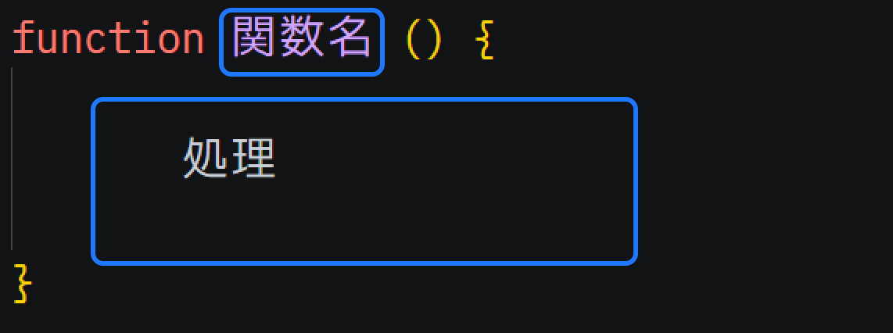

# 関数

プログラミングにおける「関数」とは、複数の処理をひとまとめにし、名前をつけたものです。
同じ処理を何度も繰り返し記述するのを防ぎ、プログラムの再利用性や可読性を高めるための最も基本的な機能です。
関数が分かるとプログラミングがグッと面白くなります。

## 関数を定義して呼び出す

関数について詳しく学習する前に、基本的な用語をおさらいしましょう。

- 関数を宣言（定義）するには、`function` キーワードを使用し、実行したいコードを波括弧`{...}`の中に記述します
- 関数を呼び出すと、その関数に含まれるすべてのコードが実行されます。

```js
// functionは関数を定義するためのキーワードです。
// mainは関数の名前です。名前は自由に付けることができます。
// {} で括られた1行が実行したいコードです。
function main() {
    console.log('こんにちは');
}
```

関数には以下のようなメリットがあります。

- コードが再利用可能になる
    - 何度も使用する必要があるコードをコピーして貼り付ける代わりに、必要なときに関数を呼び出すだけで済む
- コードが読みやすくなる
    - やりたいこと１つにつき１つの関数を作りわかり易い名前をつければ、他の開発者やチームメイトだけでなく、未来の自分自身もコードが何をしているかを正確に把握するのに役立ちます。

関数を定義する構文を次の図に示します。



関数を呼び出すには関数名の後ろに`()`を付けるだけです。
```js
// これはmain関数を呼び出す例です。
main();
```

[このリンク](https://paiza.io/projects/DDm_b7AsBhnhRQM7bBZQrA)を開き、
実際に定義した関数を呼び出してみましょう。

## 関数をから値を返す
