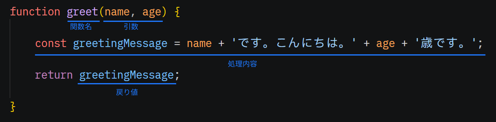

# 複数のパラメータを持つ関数

前のページでは、名前に応じてメッセージを変更する引数を追加しました。
しかし、1 つの関数に複数の引数を定義することもできます。
ここでは`greet(name)`関数に年齢の引数も追加して挨拶文を変更してみましょう。


引数を追加する方法は簡単で、`()`の中に引数名を`,`(カンマ)区切りで列挙するだけです。

```js
// 引数で受け取った名前と年齢に応じて挨拶文を生成
function greet(name, age) {
    const greetingMessage = name + 'です。こんにちは。' + age + '歳です。';
    return greetingMessage;
}
```

呼び出す側も同様に、カンマ区切りで引数を列挙しましょう。

```js
// greet関数を呼び出して、戻り値を代入
const message = greet('ロト', 18);
// 代入したメッセージを出力
console.log(message);
```

[ここ](https://paiza.io/projects/AwRCA02lI2crW3QvoeTuhg)から実行してみましょう。

この様にパラメータを変更して、いろいろなメッセージを作ることも出来ます。

```js
console.log(greet('ロト', 18));
console.log(greet('アルス', 16));
console.log(greet('パパス', 40));
```

## 最終的のまとめ

最終的にできあがった`greet(name, age)`関数を例に、
関数の構文をまとめます。


