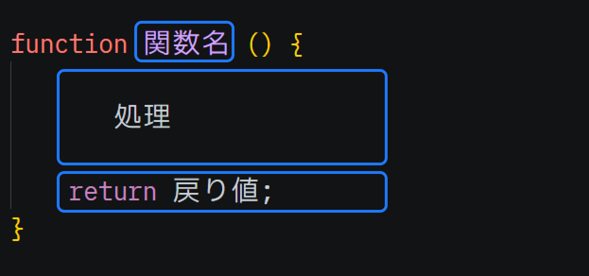

# 関数から値を返す

関数は処理を実行するだけではなく、
「戻り値」と呼ばれるデータを、呼び出し元に返却することが出来ます。
「戻り値」を返却するには、`return`というキーワードに続けて、返却したい値を記述するだけです。



```js
// 戻り値を返す関数を定義
function greet() {
    return `こんにちは`;
}

function main() {
    // greet関数を呼び出して、戻り値を代入
    const message = greet();
    // 代入したメッセージを出力
    console.log(message);
}

// main関数を呼び出し
main();

```

[このリンク](https://paiza.io/projects/7tp5CuyudAo_lMUi6JkxxA)を開いて実行してみましょう。
